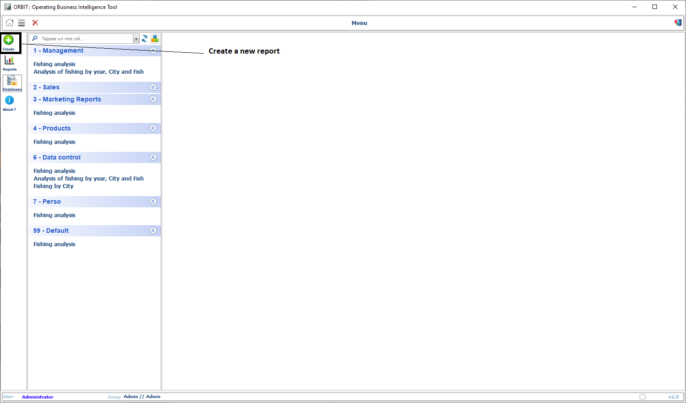
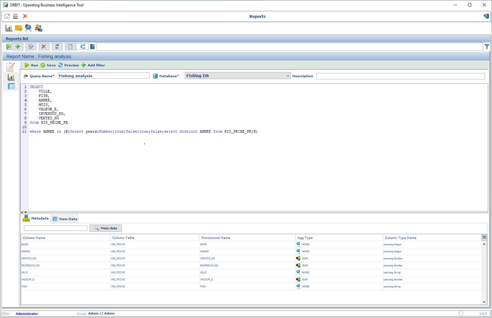
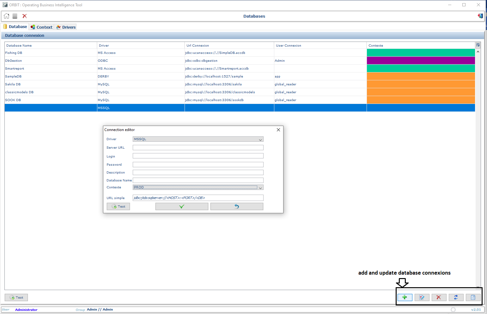
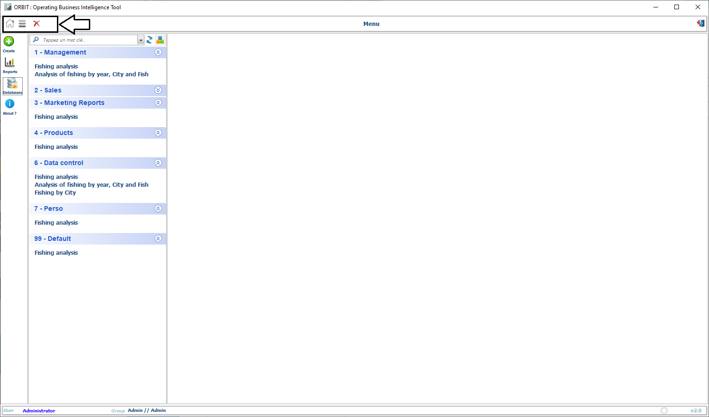

# Orbit - Business Intelligence Made Simple

Orbit is an open-source operating business intelligence tool that empowers organizations to easily access and manage their data. Below is a detailed overview of its key features to help you get started with Orbit.

---

## 🖥️ Main Screen - Launch Your Reports
The main screen of Orbit serves as a central hub where users can quickly access and launch deployed reports. This intuitive interface makes it easy to find the right report and execute it in just a few clicks.

### Key Features:
- **Quick Access:** All deployed reports are neatly organized for quick navigation.
- **Search Functionality:** Easily find the report you need with the built-in search tool.
- **Launch Reports:** Run your reports instantly and view the results in real-time.

---

## 📋 Workflow - Creating a New Report
Creating a new report in Orbit is a straightforward process. Here’s a step-by-step guide to get you started:

1. **Navigate to the Admin Console.**
2. **Select 'Create New Report.'**
3. **Define the report parameters (name, data source, filters, etc.).**
4. **Customize the report layout and visuals.**
5. **Deploy the report to make it available on the main screen.**

For a detailed tutorial, check out our [Report Creation Guide](./userGuide.md).

---

## 🛠️ Admin Console - Manage All Reports
The Admin Console is where administrators can view, create, edit, and update all existing reports. This powerful tool allows for complete control over your reporting environment.

### Key Features:
- **View Reports:** Access a complete list of all deployed reports.
- **Create New Reports:** Easily set up new reports with customizable options.
- **Edit Existing Reports:** Update parameters, layouts, and data sources as needed.
- **Manage Permissions:** Control who can access each report.

---

## ⚙️ Database Connections - Configuration Settings
Orbit provides a simple way to configure database connections, ensuring seamless access to your data sources.

### Key Features:
- **Add New Connections:** Set up new data source connections with ease.
- **Edit Existing Connections:** Modify connection details as your database environment evolves.
- **Secure Access:** Ensure data integrity with secure connection settings.

---

## 📂 Menu Navigation - Efficient Report Management
The top menu bar in Orbit provides essential navigation tools to help users manage their reports efficiently.

### Key Features:
- **Executed Reports:** View a list of all reports you have executed.
- **Close Unused Reports:** Keep your workspace tidy by closing reports you no longer need.
- **Quick Navigation:** Seamlessly switch between different reports and sections of the tool.

---

## 🚀 Get Started with Orbit
To start using Orbit, visit our [GitHub Repository]([https://github.com/](https://dashboardtools.github.io/Orbit/)) and follow the setup instructions. Join our growing community and contribute to making business intelligence accessible to everyone.

Happy reporting! 🎉
