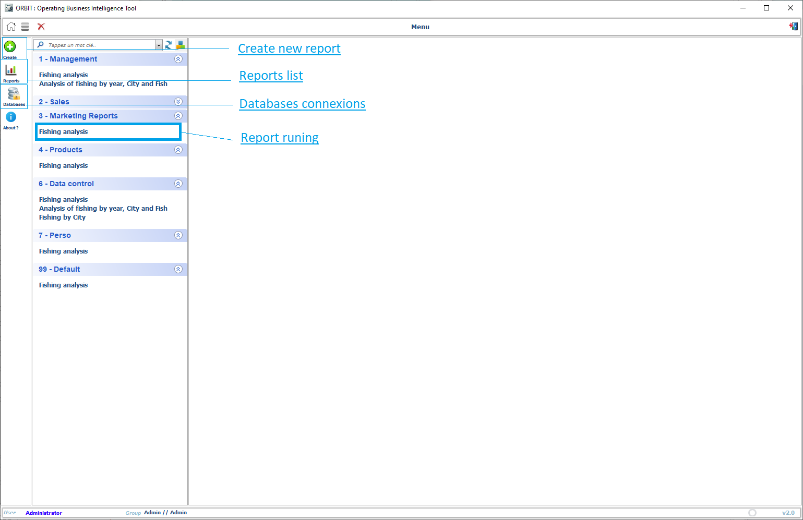
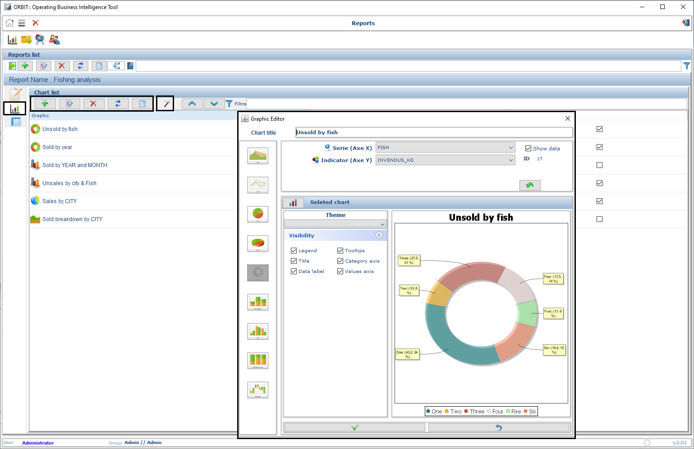
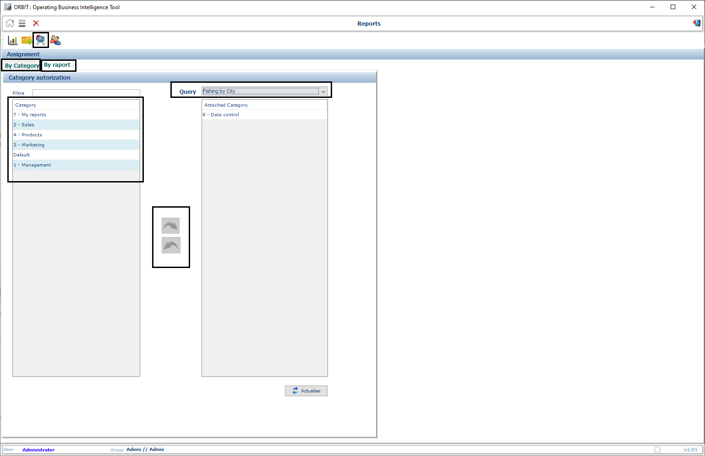
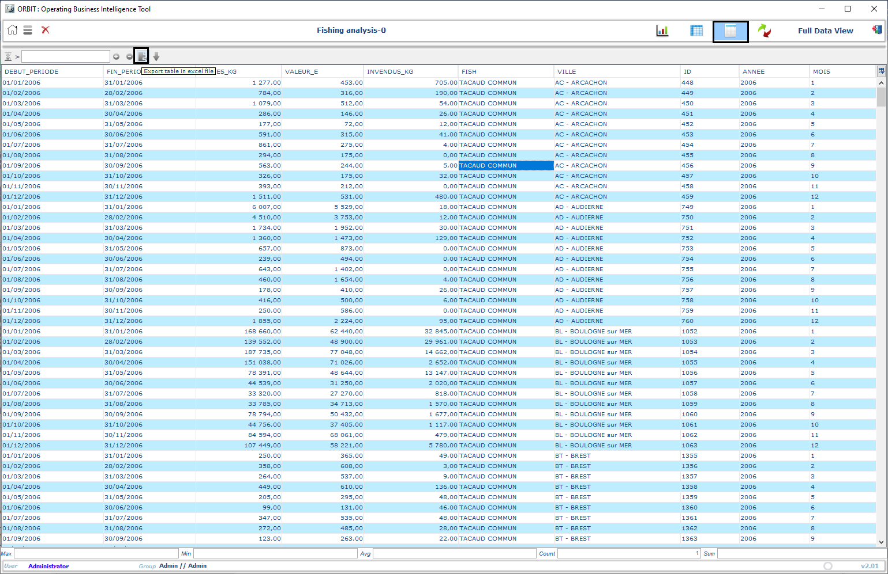
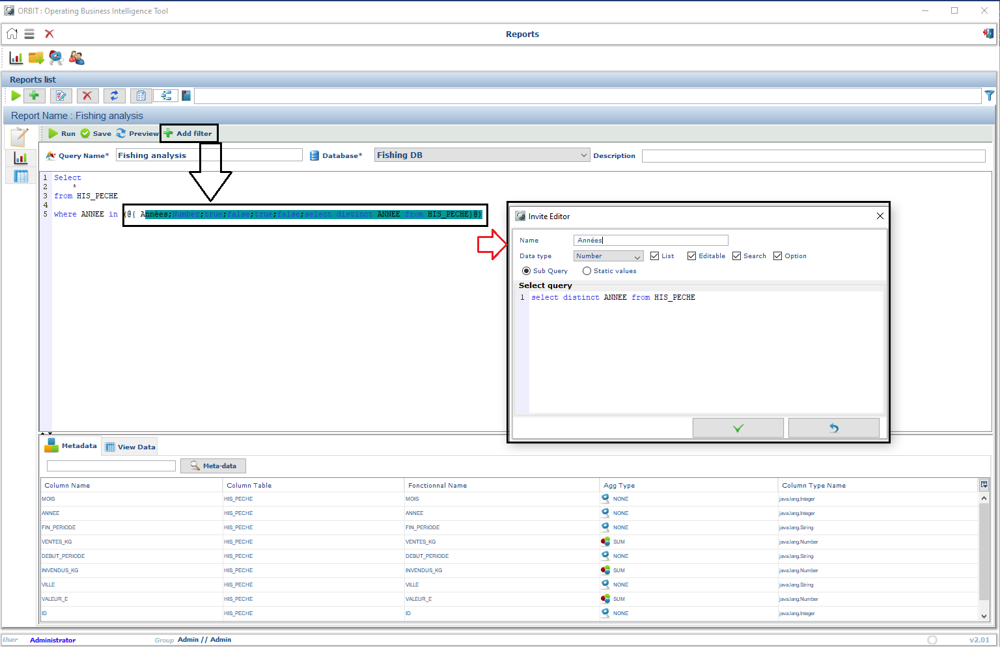

# **ORBIT - OpeRationg Business Intelligence Tool**

Welcome to the documentation for **ORBIT**. This guide will walk you through the different steps to install, configure, and use the application, complete with screenshots for better understanding.

## **Table of Contents**
1. [Installation](#installation)
2. [Creating Your First Query](#creating-your-first-query)
3. [Generating Charts and Reports](#generating-charts-and-reports)
4. [Publishing Reports](#publishing-reports)
5. [Exporting Data](#exporting-data)
6. [Customizing Filters](#customizing-filters)

---

## **1. Installation**

To install the application, follow these steps:

1. **Download** the application file from the [SourceForge page](https://sourceforge.net/projects/orbitap/).
2. Unzip the downloaded file into your desired folder.
3. Ensure that **Java 8** or higher is installed on your system.
4. Launch the application by clicking the `d-clic` icon.

---

## **2. Creating Your First Query**

After installing, follow these steps to create your first query:

1. Open the application, and from the home page, select **"Create Query"**.
2. Choose the **data sources** you want to query from the available list.
3. Apply **dynamic filters** to customize your report (e.g., time period, country, product).
4. Select your **database connexion**
  
5. Add your **query**
  
6. Add your **charts**
  
7. Add your **analytics**
   
8. Run your **Report**
   
9. View your **Report**
   
10.Deploy your **Report**
   
---

## **3. Generating Charts and Reports**

Once the query is executed, you can generate different types of charts and reports:

1. Select **"Chart Options"** to choose from histograms, line graphs, and pie charts.
2. Customize the chart based on the data fields in your query.

---

## **4. Publishing Reports**

You can organize your reports and make them easily accessible:

1. Select **"Publish Report"** and assign a custom category.
2. The report will appear on the homepage under the relevant category.

---

## **5. Exporting Data**

To export the generated data:

1. After running a report, click **"Export to Excel"**.
2. Choose the location where you'd like to save the file.

---

## **6. Customizing Filters**

Refine your data analysis by applying filters to any field in your query:

1. Open a report and use the filter options to narrow down the data.
2. You can apply filters to any available field like date range, region, or product.

---

## **Need Help?**

For more information or support, feel free to contact us via [ORBIT APP support](mailto:dashboardtools@gmail.com).
